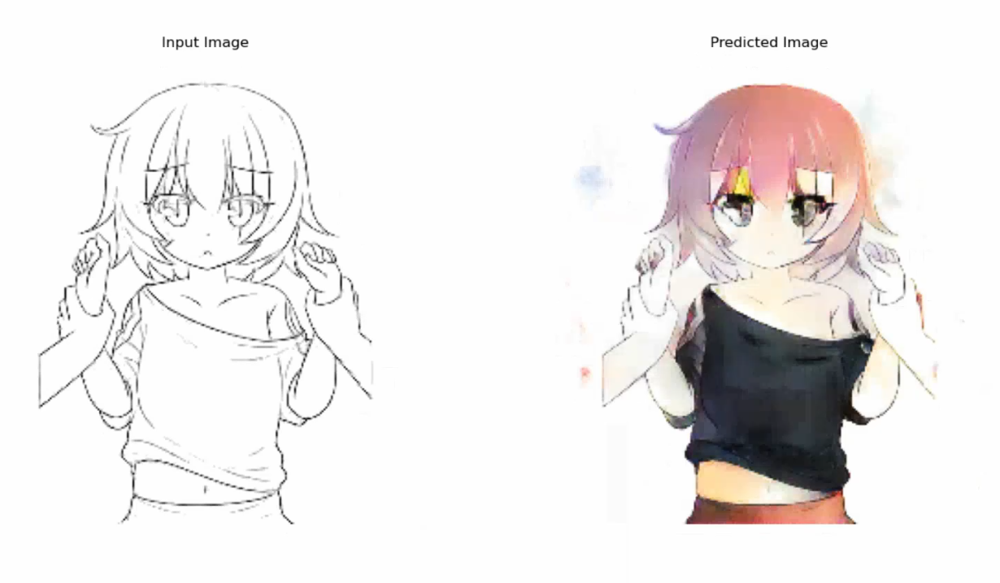

# Sketch-to-Color
We will be creating a cGAN model to return colored images from just sketches without knowing the ground truth. The original code is present in sketch_to_color.ipynb, and the latest checkpoint is present in checkpts/

A demonstration of the model is in Videos/

Another way to load the file is loading it from model/

(Download the checkpts/ and model/ from the following links:)

- [checkpts/](https://mega.nz/folder/JYcTBYDR#M-F7P-3KtUtdVfbPxz2gQg)
- [model/](https://mega.nz/folder/RNVByS4D#zcQdWszllYFLF3EnLQia9A)
## Directory structure
Have the directory structure in the following way :

. 
└── Sketch-to-Color/ 
    ├── preprocessing.py 
    ├── sketch_to_color.py 
    ├── Sketch_to_Color.ipynb 
    ├── archive/ 
    │   └── data/ 
    │       ├── colorgram/ 
    │       ├── data/ 
    │       ├── train/ 
    │       └── val/ 
    ├── sample_images/ 
    │   └── sample.png 
    ├── Videos/ 
    │   ├── demo.mp4 
    │   └── python_demo.mp4 
    ├── checkpts/ 
    │   ├── checkpoint 
    │   ├── chkpt-21.data-00000-of-00001 
    │   └── chkpt-21.index 
    ├── model/ 
    │   ├── assets 
    │   ├── variables/ 
    │   │   ├── variables-data-00000-of-00001 
    │   │   └── variables.index 
    │   └── saved-model.pb 
    └── README.md 

Note that archive : folder after downloading the dataset from Kaggle.

## Instructions :
1. You can either run the ipynb notebook (change the appropriate paths).
2. A better way is to run the sketch_to_color.py file (requires tensorflow and tkinter)
3. The file requires to choose a black and white sketch, and then displays both the sketch and predicted image side by side
4. The only files you'll need to run this are preprocessing.py, sketch_to_color.py and model/
5. Check the python_demo.mp4 video to see how to run this. Make sure you have the directory structure as shown (No need of archive or sample_images or checkpts or Videos folder for running .py file. They are needed to view demos or further train the model)

## How to improve the model
The current model has been trained for 105 epochs. Training it for something like 250 epochs would produce better results. You can tune the parameter Lambda (default set to 100) and change the batch/buffer size.

## Resources :
1. This project is an implementation of the architecture described in the paper : [Image-to-Image Translation with Conditional Adversarial Networks](https://arxiv.org/pdf/1611.07004.pdf)
2. The following article is followed for implementing the project : [Learning to Build a Model for Sketch-to-Color Image Generation using Conditional GANs](https://towardsdatascience.com/generative-adversarial-networks-gans-89ef35a60b69)
3. The model has been trained on this dataset : [Anime Sketch Colorization Pair](https://www.kaggle.com/ktaebum/anime-sketch-colorization-pair) which has around 14k sketches with ground truth.
